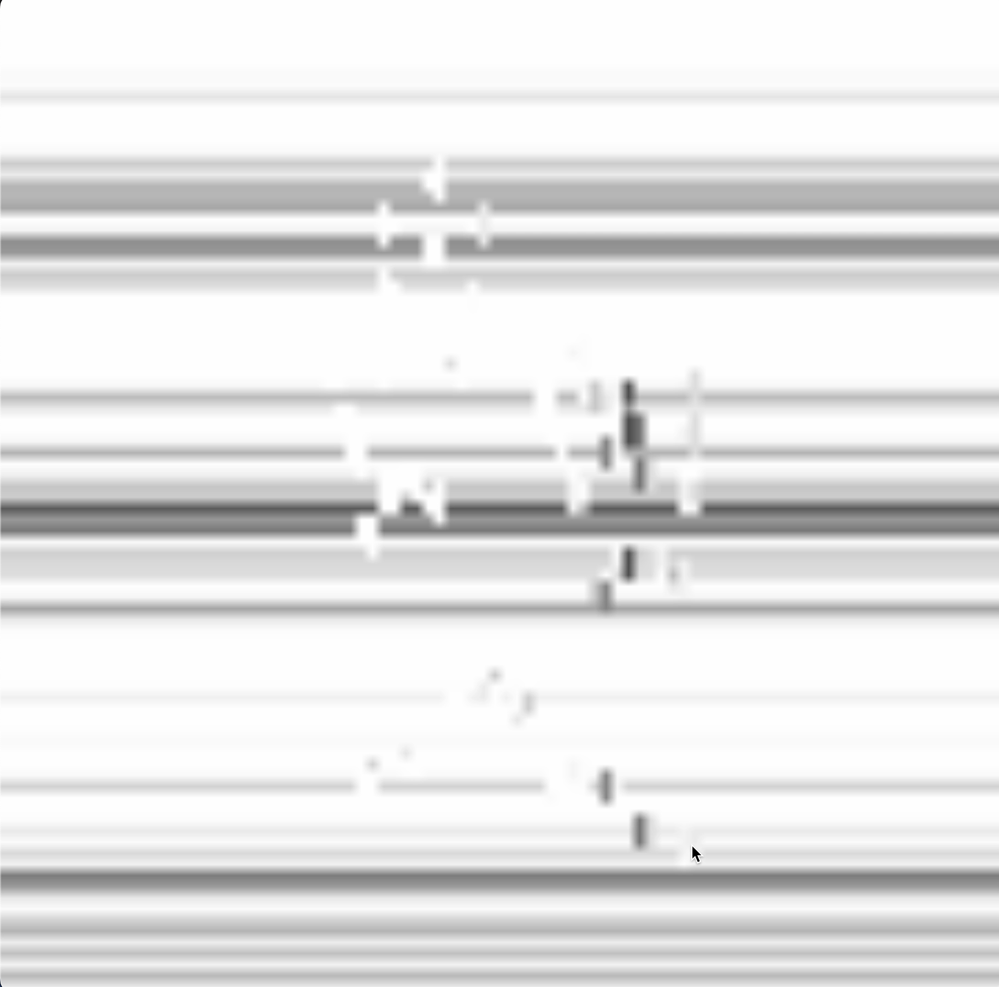

##Grasping the Void

##Short Description
*An interactive TouchDesigner installation that explores the existential fragility of human presence. It uses real-time hand tracking to distort a pixelated digital landscape, symbolizing the un-graspability of life under the "Machine Gaze."

##Concept / Intent
*In our highly digitized existence, we often feel a sense of "un-graspability"—the more we try to define our reality through technology, the more it dissolves into abstraction. Inspired by the prompt "To be watched or to be surveilled by a machine", this work portrays machine vision not as a cold surveillance tool, but as a futile recorder of a fading human spirit.

##Technology Used
*This project focuses on the flow of data between biological movement and digital distortion:
*MediaPipe : I used this framework to capture 21 real-time hand landmarks. It functions as the primary sensor that translates my physical gestures into digital coordinates.
*TouchDesigner : Instead of traditional text-based coding, I utilized this node-based environment to build a Hybrid Pipeline. It allows data to flow seamlessly between signal processing and visual rendering.
*Pixelated Background : I created a black-and-white mosaic using a Noise generator. By forcing a low resolution and using "Nearest Pixel" sampling, I achieved a stark, industrial grid look.
Interaction Logic : This is the core of the interaction. I mapped the hand coordinates to interfere with the background. By using a "Displace" operation, the pixels warp and melt wherever the hand moves, creating the sensation of "touching" a fluid, unstable reality.

##How to Run / Install
*Install TouchDesigner .
*Ensure your webcam is active. The tracking will start automatically upon hand detection.

##Requirements
*Hardware: Webcam.
*Software: TouchDesigner.

##Screenshots / Media

##Credits / Acknowledgements
*Ryoji Ikeda: For the conceptual and visual inspiration.

##Contact / Links
*Author: Hanzhe Zhong(hzhon003@gold.ac.uk)

##Contact / Links
*GitHub: https://github.com/zhonghanzhe/Hanzhe_Grasping_the-_Void